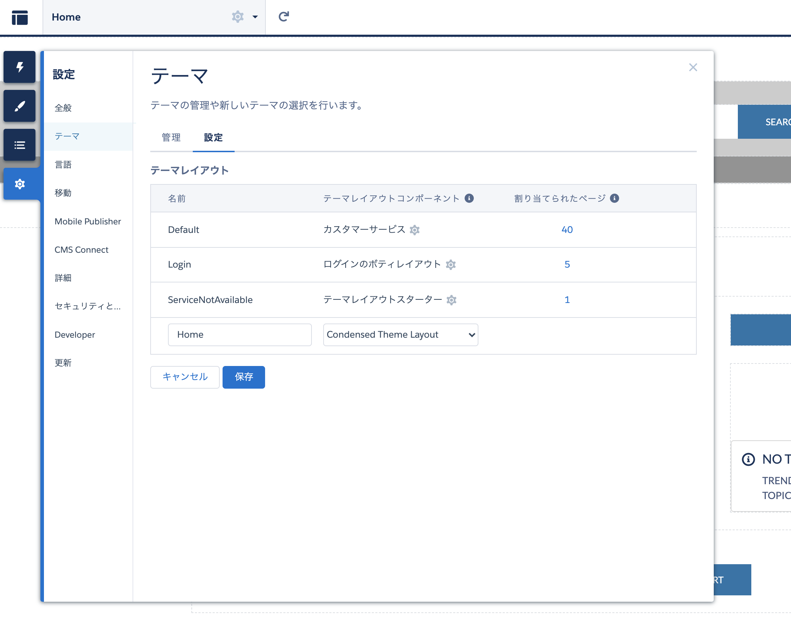
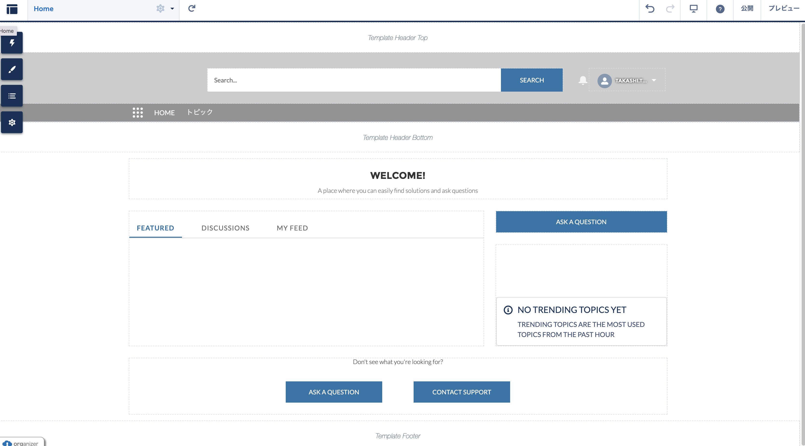
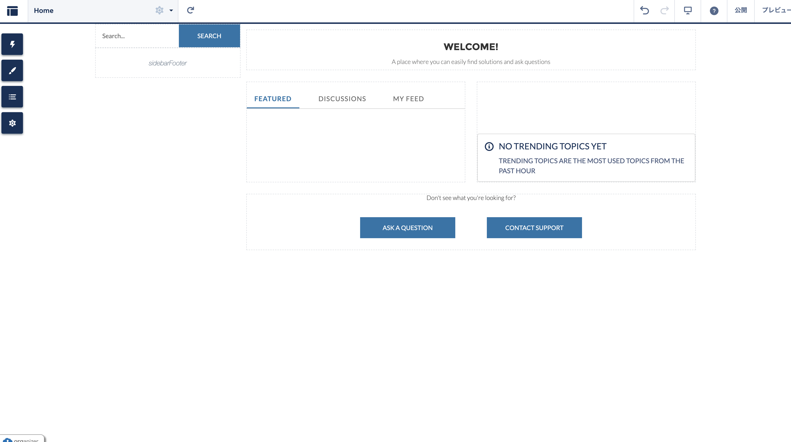

## Trailhead
[ExperienceBuilderサイト用のカスタムテーマレイアウトコンポーネントを構築する](https://trailhead.salesforce.com/ja/content/learn/projects/communities_theme_layout)

## テーマレイアウトコンポーネント
[condensedThemeLayout.cmp](aura/condensedThemeLayout/condensedThemeLayout.cmp)

* エクスペリエンスビルダーの[設定] | [設定]に表示するには テーマ| エリアを構成します。
* テーマレイアウトコンポーネントは、`forceCommunity：themeLayout`インターフェイスを実装する必要があります。
* ページごとに変化するコンテンツをテーマレイアウトコンポーネント内に表示する場所に`{！v.body}`を追加します。
* `Aura.Component[]`として宣言され、マークアップに含まれる属性は、テーマレイアウトコンポーネントでオープンリージョンとしてレンダリングされます。これは、テーマレイアウトの基本構造を形成します。ユーザーは、ExperienceBuilderでこれらのリージョンにドラッグアンドドロップコンポーネントを追加できます。
* このコードは、SLDSグリッドシステムを使用して、レイアウトに構造を追加します。

変更前

変更後

### トークンバンドル
[defaultTokens.tokens](aura/defaultTokens/defaultTokens.tokens)

* トークンバンドルを定義して、ExperienceBuilderのテーマパネルで定義されたSLDSトークンとブランド値にアクセスします。
* Lightningコンポーネントが、ロゴやフォントファミリなどを制御するブランドトークンにアクセスできるようにするには、同じ名前空間でトークンバンドルを定義します。
* トークンバンドルは`forceCommunity：base`を拡張します。これにより、SLDSによって公開されるすべてのトークンと、ExperienceBuilderのテーマパネルで定義されたブランド値にアクセスできます。

### CSSでトークンを使用する
[condensedThemeLayout.css](aura/condensedThemeLayout/condensedThemeLayout.css)

Experience Builderでは、テーマパネルの各プロパティは1つ以上の標準デザイントークンにマップされます。したがって、コンポーネントのCSSでトークンを使用することにより、管理者がテーマパネルを使用してコンポーネントの外観をすばやく簡単に更新できるようになります。

## カスタムナビゲーションメニューコンボーネント
[verticalNav.css](aura/verticalNav/verticalNav.css)

* `forceCommunity：navigationMenuBase`コンポーネントを拡張すると、新しいコンポーネントは、サイトのナビゲーションメニューコンポーネントで定義されているすべてのナビゲーションメニュー項目に自動的にアクセスできるようになります。管理者は、ExperienceBuilderのナビゲーションメニューで項目を定義および更新できます。
* 動作中のメニューを表示するために、この単純な順序なしリストは、拡張抽象コンポーネントで定義されているmenuItemsの配列を反復処理し、配列内の各エントリに対して<li>を出力します。
このコードは、aura式の構文を利用して、気の利いたことを実行します。
* アイテムがアクティブであるかどうかに応じて、`slds-is-active`クラスをリストアイテムに条件付きで追加できます。
* また、`data-menu-item-id`をアイテムの一意のIDに設定します。これは、後で対応するアイテムに移動するために使用できます。

## カスタム検索コンポーネント
[customSearch.cmp](aura/customSearch/customSearch.cmp)

* このコードは`<lightning：ButtonIcon>`コンポーネントを使用し、クリックハンドラーを含みます。また、検索テキストを含む`searchText`という属性が含まれ、（`<input>`の代わりに）`<ui：inputText>`コンポーネントを使用して値をバインドします。

## 単一のレコードを表示するコンポーネント
[customSearchResultItem.cmp](aura/customSearchResultItem/customSearchResultItem.cmp)

## レコードを一覧表示するドラッグアンドドロップコンポーネント
[customSearchResultsList.cmp](aura/customSearchResultsList/customSearchResultsList.cmp)

* Experience Builderの「コンポーネント」パネルに表示するには、コンポーネントは`forceCommunity：availableForAllPageTypes`インターフェースを実装する必要があります。
* コンポーネントなどのリソースに`access="global"`のマークを付けて、リソースを独自の組織の外部で使用できるようにします。
* コントローラ：ブラウザのセッションストレージからコンポーネントに渡されるレコードIDリストに依存しています。このメソッドを使用すると、URLに影響を与えることなく、データをページ間で渡すことができます。